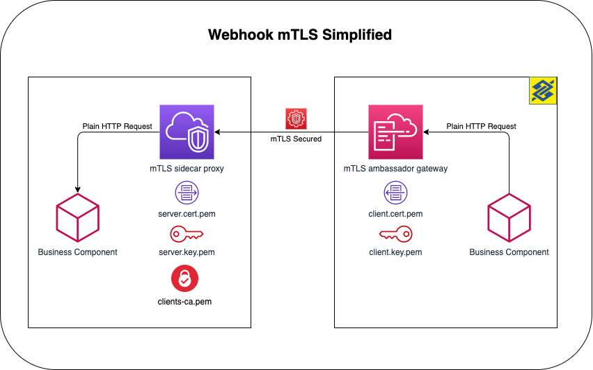

# API mTLS Sidecar Proxy (Server)

Sidecar Docker container used to authenticate using mTLS for the Open Banking and PIX API communication as client (request) or as server (webhook)

## Quick Start

To quickly take a look at this running, download the test certificates located at the [example/sidecar/server-certs](/example/sidecar/server-certs) to a local folder named **"certs"** and bring up this docker-compose:

```yml
version: "3.7"

services:
  mtls-sidecar:
    image: labbsr0x/api-mtls-sidecar-proxy:0.0.1
    environment:
      - ALLOWED_CERTIFICATE_FINGERPRINT=all
      - PROXY_PASS=https://mtls-bff.free.beeceptor.com/
    volumes:
      - ./certs:/etc/nginx/conf.d/certs
    ports:
      - 443:443
```

Then try `curl` **without** a client certificate to see a Bad Request response:

```bash
curl -k https://localhost
```

Response:

```bash

<html>
<head><title>400 No required SSL certificate was sent</title></head>
<body>
<center><h1>400 Bad Request</h1></center>
<center>No required SSL certificate was sent</center>
<hr><center>nginx/1.18.0</center>
</body>
</html>

```

And then run a `curl` **with** a valid client certificate to see the `https://mtls-bff.free.beeceptor.com` result proxied through the sidecar mTLS:

```bash
curl --cacert example/sidecar/server-certs/server-ca.pem --key example/client/certs/client-key.pem --cert example/client/certs/client.pem -k https://localhost
```

Response will be the home page of https://mtls.run/:

```bash
!DOCTYPE html><html lang="en"><head><meta name="viewport" content="width=device-width"/><meta charSet="utf-8"/><title>mTLS Best Friend</title><link rel="icon" href="/logo_labbs.png"/><meta name="next-head-count" content="4"/><link rel="preload" href="/_next/static/css/4a81d3e230deb4774270.css" as="style"/><link rel="stylesheet" href="/_next/static/css/4a81d3e230deb4774270.css" data-n-g=""/><noscript data-n-css=""></noscript><link rel="preload" href="/_next/static/chunks/main-a3e8d7207ca8525c43de.js" as="script"/>
...
```

## The whole pattern

The full pattern implemented here is the sidecar-proxy and ambassador-gateway. You can [check here](https://github.com/bancodobrasil/api-mtls-ambassador-gateway) the ambassador-gateway part.



## Testing with a Browser (Firefox)

Open **https://localhost/** on your browser and you will be warned about an insecure certificate. Accept the "risks" and then check that the server returns a `400 Bad Request` to the browser. That's because you have not provided a client cetificate accepted by the server.

If using Firefox, import the client certificate `examples/client/certs/client.cert.p12` on the Preferences page and reload the page. The browser will now ask you which certificate you want to use. Choose the imported certificate and voilà!

## Securitying a local API Example

Check [this example](/example) on how to secure a locally running API with this Sidecar

## Bundling certificates in a Docker imagem

In the [example folder](/example) you have some instructions on how to build this sidecar bundling your certificates. Basically, you will create a Dockerfile with the following contents:

```Dockerfile
FROM bancodobrasil/api-mtls-sidecar-proxy:0.1.0

COPY path/to/server.pem /etc/nginx/conf.d/certs/server.pem
COPY path/to/server-key.pem /etc/nginx/conf.d/certs/server-key.pem
COPY path/to/clients-ca.pem /etc/nginx/conf.d/certs/clients-ca.pem
```

This way you won't need to map any volume or define environment var. The container will be built specifically for one given client.

## External References

- https://jamielinux.com/docs/openssl-certificate-authority/create-the-root-pair.html: This guide demonstrates how to act as your own certificate authority (CA) using the OpenSSL command-line tools.
